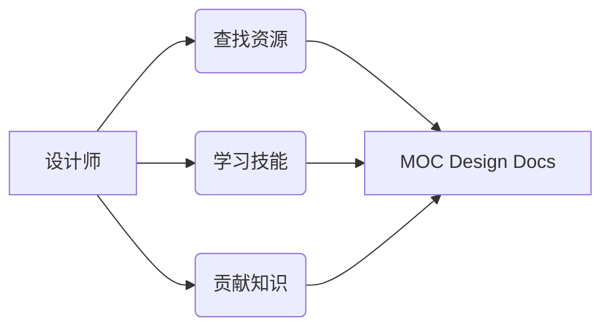
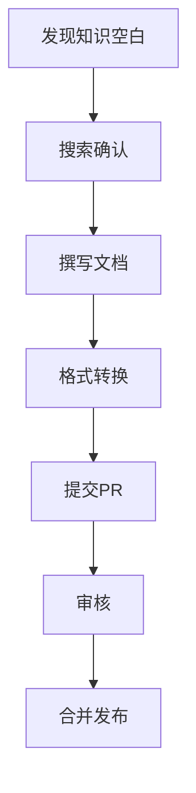
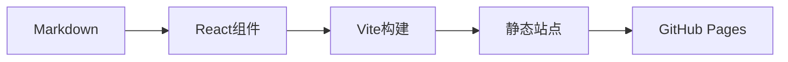

# MOC Design Docs 协作指南

> **📦 可扩展·协作式在线设计知识库**  
> 专为MOC清唱团打造的设计文档平台，助力创意高效落地


[](https://creativecommons.org/licenses/by-nc-sa/4.0/)

## 📚 目录导航

- [MOC Design Docs 协作指南](#moc-design-docs-协作指南)
  - [📚 目录导航](#-目录导航)
  - [🎯 项目概述](#-项目概述)
  - [🏗️ 网站结构](#️-网站结构)
    - [三大核心板块](#三大核心板块)
    - [内容聚焦领域](#内容聚焦领域)
  - [🚀 快速开始](#-快速开始)
  - [✍️ 贡献指南](#️-贡献指南)
    - [成为贡献者](#成为贡献者)
    - [文档写作规范](#文档写作规范)
    - [Markdown核心结构](#markdown核心结构)
  - [📝 文档规范](#-文档规范)
    - [内容范围](#内容范围)
    - [质量要求](#质量要求)
  - [⚙️ 技术架构](#️-技术架构)
    - [技术栈](#技术栈)
    - [项目树结构](#项目树结构)
    - [自动化流程](#自动化流程)
  - [👥 维护团队](#-维护团队)

## 🎯 项目概述

> [!NOTE]
> **平台价值**
> 降低设计协作成本，避免重复踩坑，加速新人成长，沉淀团队知识资产

MOC Design Docs是一个**开源静态设计文档平台**，专为设计团队打造的知识协作中心。我们汇集了：

- 🎨 设计理论与实践方案
- 🛠️ 实用工具与资源指南
- 📐 工作流程与规范标准
- 🏆 项目案例与经验总结



## 🏗️ 网站结构

### 三大核心板块

| 板块 | 内容 | 适用场景 |
|------|------|----------|
| **📖 教程** | 网站使用指南<br>文档贡献规范 | 新成员入门<br>贡献者参考 |
| **📄 文档** | 设计理论<br>工具资源<br>工作流程 | 设计过程中的全流程参考 |
| **📂 项目参考** | MOC清唱团历史项目<br>设计决策记录 | 项目框架参考<br>经验借鉴 |

### 内容聚焦领域

- 🎯 **设计基础**：色彩、字体、版式、印刷
- 🧩 **设计资源**：开源素材、工具平台
- 📱 **微信公众号**：推文排版、H5设计
- 🖨️ **实体物料**：印刷流程、周边生产
- 💡 **创意前期**：母题构思、灵感收集

## 🚀 快速开始

参阅[快速开始](https://pinowine.github.io/moc-design-docs/tutorials/%E5%BF%AB%E9%80%9F%E5%BC%80%E5%A7%8B)章节

> [!TIP]
> **搜索技巧**  
> 所有板块均内置搜索引擎，通过标题关键词可快速定位所需内容

## ✍️ 贡献指南

### 成为贡献者

我们鼓励所有设计师分享经验！贡献流程详见[帮助建设我们的文档](https://pinowine.github.io/moc-design-docs/tutorials/%E5%B8%AE%E5%8A%A9%E5%BB%BA%E8%AE%BE%E6%88%91%E4%BB%AC%E7%9A%84%E6%96%87%E6%A1%A3)：



### 文档写作规范

> [!NOTE]
> 详见[文档写作规范](https://pinowine.github.io/moc-design-docs/tutorials/%E5%B8%AE%E5%8A%A9%E5%BB%BA%E8%AE%BE%E6%88%91%E4%BB%AC%E7%9A%84%E6%96%87%E6%A1%A3/%E6%96%87%E6%A1%A3%E5%86%99%E4%BD%9C%E8%A7%84%E8%8C%83)

### Markdown核心结构

> [!NOTE]
> 详见[使用Markdown语言撰写文档](https://pinowine.github.io/moc-design-docs/tutorials/%E5%B8%AE%E5%8A%A9%E5%BB%BA%E8%AE%BE%E6%88%91%E4%BB%AC%E7%9A%84%E6%96%87%E6%A1%A3/%E4%BD%BF%E7%94%A8Markdown%E8%AF%AD%E8%A8%80%E6%92%B0%E5%86%99%E6%96%87%E6%A1%A3)

## 📝 文档规范

### 内容范围

✅ **推荐主题**

- 色彩理论应用
- 印刷工艺解析
- 微信公众号排版
- 实体物料生产
- 设计工作流程

⛔ **暂不收录**

- UI/UX设计（Web/APP）
- 产品包装设计
- 工业交互设计
- 建筑景观设计
- 游戏动画设计

### 质量要求

> [!IMPORTANT]
> **内容质量标准**
>
> 1. **实践验证**：分享经过实际项目验证的方法
> 2. **普适价值**：优先通用性强的设计原则
> 3. **结构清晰**：模块化组织内容
> 4. **示例丰富**：提供实际应用案例
> 5. **持续更新**：标记最后修订日期

## ⚙️ 技术架构

### 技术栈



> [!NOTE]
> **技术术语说明**
>
> - **Vite**：下一代前端构建工具，提供极速的开发体验
> - **GitHub Pages**：GitHub提供的静态网站托管服务
> - **Markdown渲染器**：将Markdown转换为HTML的组件

| 组件 | 技术选择 |
|------|----------|
| **前端框架** | React + TypeScript |
| **构建工具** | Vite |
| **文档引擎** | 自定义Markdown渲染器 |
| **托管平台** | GitHub Pages |

### 项目树结构

```bash
moc-design
├── index.html
├── public
│   ├── data
│   │   ├── documentStructure.json
│   │   ├── projectStructure.json
│   │   └── tutorialStructure.json
│   ├── documents
│   │   ├── documents
│   │   ├── projects
│   │   └── tutorials
│   ├── images
├── scripts
│   └── generateStructure.cjs
├── src
│   ├── App.tsx
│   ├── assets
│   ├── components
│   │   ├── Breadcrumb
│   │   │   ├── Breadcrumb.css
│   │   │   └── Breadcrumb.tsx
│   │   ├── Editor
│   │   │   ├── Editor.css
│   │   │   └── Editor.tsx
│   │   ├── Footer
│   │   │   ├── Footer.css
│   │   │   └── Footer.tsx
│   │   ├── Loading
│   │   │   ├── Loading.css
│   │   │   └── Loading.tsx
│   │   ├── MarkdownRenderer
│   │   │   ├── MarkdownFetcher.tsx
│   │   │   ├── MarkdownRenderer.css
│   │   │   ├── MarkdownRenderer.tsx
│   │   │   └── plugins
│   │   ├── Navbar
│   │   │   ├── Navbar.css
│   │   │   └── Navbar.tsx
│   │   └── Search
│   │       ├── Search.css
│   │       └── Search.tsx
│   ├── main.tsx
│   ├── pages
│   │   ├── About
│   │   │   ├── About.css
│   │   │   └── About.tsx
│   │   ├── Document
│   │   │   ├── Document.css
│   │   │   └── Document.tsx
│   │   ├── Home
│   │   │   ├── Home.css
│   │   │   └── Home.tsx
│   │   └── Tool
│   │       ├── Tool.css
│   │       └── Tool.tsx
│   ├── styles
│   │   ├── main.css
│   │   └── variables.css
│   ├── utils
│   │   ├── getDocumentPath.ts
│   │   ├── getMarkdownFiles.ts
│   │   └── highlightMatchedText.ts
├── vite.config.ts
└── vitest.config.ts
```

### 自动化流程

> [!NOTE]
> **自动化系统**
>
> - **结构树生成**：自动解析文档头生成导航JSON
> - **CI/CD**：提交即自动部署
> - **搜索索引**：基于标题关键词的即时搜索


## 👥 维护团队

| 角色 | 负责人 | 职责 |
|------|--------|------|
| 🛠️ 技术负责人 | @pinowine | 架构设计、终审 |
| 📝 核心维护 | @pinowine | 组件文档维护 |

**参与方式**：

- 🐞 常规问题：[提交Issue](https://github.com/pinowine/moc-design-docs/issues)
- ✨ 文档贡献：Fork → 修改 → PR

> [!NOTE]
> **致谢**  
> ChatGPT辅助完成70%的代码实现，DeepSeek辅助整合本自述文件

---
© 2024 MOC清唱团设计组 | [更新日志](https://github.com/pinowine/moc-design-docs/commits/main) | [在线文档](https://pinowine.github.io/moc-design-docs/) | [CC BY-NC-SA 4.0 许可证](LICENSE.md)
